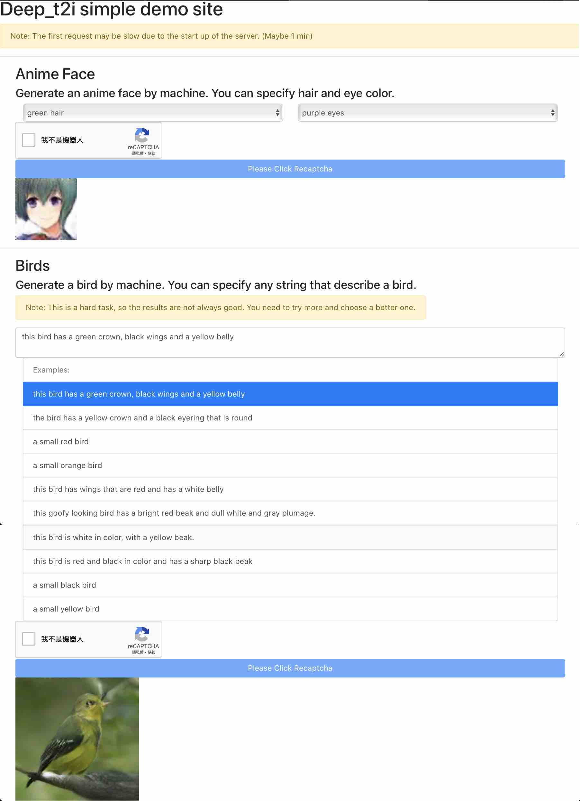

# Deep_t2i Demo Client Site
> Client side code of https://github.com/cwza/deep_t2i/tree/master/server

## Web Interface
https://cwza.github.io/deep_t2i_web/

## Functionality
* Generate anime face image by machine. You can specify hair color and eye color.
* Generate bird image by machine. You can specify any string that describe the bird.



## Notice
1. The server is deployed on google cloud run. Google will shutdown it when there are no requests for a while. So the first request may be slow due to the start up of server.
2. For birds, the results are not always good. You need to try more and choose a better one.


## Environment Variables
Create .env.local at root directory and use values like:
```
REACT_APP_SERVER=mock or dev or prod(mock: no server use local image files, dev: use local dev server, prod: use production server)
REACT_APP_PROD_URL=deployed url of production server
REACT_APP_CHECK_RECAPTCHA=true or false to specify whether to check recaptcha at client side.
REACT_APP_RECAPTCHA_SITEKEY=Your recaptcha site key
```

## Dev
* npm install
* Correctly set up environment variables in .env.local
* npm start

## Deploy to Github page
* Correctly setup environment variables in .env.production
* Set "homepage" in package.json to your github page url
* npm run deploy
